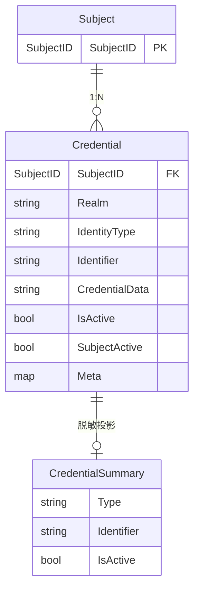

# Identity Core

[](https://pkg.go.dev/github.com/modern-magic-go/identity)
[](https://go.dev/)

> Headless（无 UI、无 Session）Go 身份核库——把外部标识到系统实体的映射和凭证校验封装为可复用的原子能力。

## 简介

`identity` 是一个纯函数式 Go 库，提供用户身份凭证的绑定与校验能力。它不管理 Token、不持有 Session、不写数据库，只做四件事：

1. **静默注册**：外部标识（手机号/用户名/微信 OpenID）→ 系统内 `SubjectID`
2. **凭证校验**：密码（bcrypt）或 TOTP 一次性验证码是否匹配
3. **凭证绑定**：为一个 Subject 添加新的登录方式
4. **凭证列表**：查看一个 Subject 持有哪些登录方式

上层服务（如 Auth Service）持有 Token 管理与流程编排，本库只做原子校验。

## 安装

```bash
go get github.com/modern-magic-go/identity
```

## 快速开始

```go
package main

import (
    "context"
    "github.com/modern-magic-go/identity"
    "github.com/modern-magic-go/identity/core"
    "github.com/modern-magic-go/identity/internal/store"
)

func main() {
    ctx := context.Background()

    // 1. 创建内存 Mock Store（生产环境替换为数据库实现）
    mockStore := store.NewMockStore()

    // 2. 创建 IdentityCore 入口
    ic := core.NewIdentityCore(mockStore)

    // 3. 静默登录：用户不存在则自动创建，存在则返回已有 SubjectID
    out, _ := ic.GetOrInitializeSubjectID(ctx, identity.GetOrInitSubjectInput{
        Realm:        "myapp",
        IdentityType: identity.TypePassword,
        Identifier:   "bob",
    })
    // out.SubjectID — 系统内部唯一 ID（SubjectID string）
    // out.IsNewUser — 是否新用户
}
```

## 核心概念

| 概念 | 类型 | 说明 |
|------|------|------|
| **SubjectID** | `type SubjectID string` | 全局唯一用户标识，兼容 Snowflake int64（`SubjectIDFromInt64`）和 UUID（`SubjectIDFromString`） |
| **Realm** | `string` | 领域/命名空间，账号池的物理隔离单位。同一标识在不同 Realm 下对应不同 SubjectID |
| **IdentityType** | `string` | 凭证类型，内置：`PASSWORD`、`TOTP`、`WECHAT_OPENID`、`WECHAT_UNIONID`、`EMAIL`、`SMS` |
| **Credential** | struct | 原子凭证，含 `SubjectActive`（Subject 级活跃状态）、`IsActive`（单凭证启用状态）、`Meta`（元信息） |
| **CredentialSummary** | struct | 凭证摘要（脱敏后不含加密数据），含 `IsActive` 状态 |

### 数据模型拓扑



> **唯一约束**：Credential 在 `(Realm, IdentityType, Identifier)` 三元组上唯一，同一 Realm 内不允许重复绑定同类型同标识的凭证。

- **Subject** 由 `CreateSubject` 创建，`SubjectID` 为 string 类型（兼容 Snowflake int64 和 UUID），不存储业务属性
- **Credential** 包含两层活跃状态：`SubjectActive`（Subject 级第一道闸，store 层 JOIN 填充）和 `IsActive`（单凭证第二道闸）。`SubjectActive=false` 返回 `ACCOUNT_LOCKED`，`IsActive=false` 返回 `CREDENTIAL_DISABLED`。`Credential.Meta` 存储认证附属信息（如微信 `appid`）
- **CredentialSummary** 是 Credential 的脱敏投影，返回给调用方时不包含 `CredentialData`
- **Realm 隔离**：同一外部标识在不同 Realm 下对应不同 Subject，完全物理隔离

### Realm 隔离示例

```
Realm "app_a" → bob@phone → SubjectID "1234567890"
Realm "app_b" → bob@phone → SubjectID "9876543210"  （不同的 Subject，完全隔离）
```

## API 参考

### `core.NewIdentityCore(store) *IdentityCore`

创建库的公共入口。内建 `PASSWORD`（bcrypt）和 `TOTP` 两种 verifier。

```go
func NewIdentityCore(store identity.IdentityStore) *IdentityCore
```

### `(*IdentityCore).VerifyCredential(ctx, input) (VerifyOutput, error)`

验证调用方提供的标识和凭证是否匹配。两层校验闸：`SubjectActive=false` → `ACCOUNT_LOCKED`，`IsActive=false` → `CREDENTIAL_DISABLED`。

```go
type VerifyInput struct {
    Realm        string       // 领域
    IdentityType IdentityType // 凭证类型
    Identifier   string       // 标识符（手机号 / 用户名）
    InputData    string       // 用户输入的验证物（明文密码 / TOTP code）
}

type VerifyOutput struct {
    Success   bool       // 校验是否通过
    SubjectID SubjectID  // 仅在 Success=true 时有效
    ErrorCode string     // ACCOUNT_LOCKED / CREDENTIAL_DISABLED / INVALID_CREDENTIAL / CREDENTIAL_NOT_FOUND
    ErrorMsg  string     // 人类可读描述
}
```

### `(*IdentityCore).GetOrInitializeSubjectID(ctx, input) (GetOrInitSubjectOutput, error)`

静默解析标识符：有则返回已有 SubjectID，无则创建新 Subject。
只检查 `SubjectActive`（不检查 `IsActive`，单凭证被禁不影响标识映射）。
遇到 `SubjectActive=false` 返回 `ErrAccountLocked`。

```go
type GetOrInitSubjectInput struct {
    Realm        string
    IdentityType IdentityType
    Identifier   string
}

type GetOrInitSubjectOutput struct {
    SubjectID SubjectID // 已有或新创建的 subject_id
    IsNewUser bool      // 是否为新注册
}
```

### `(*IdentityCore).BindCredential(ctx, input) error`

为已存在的 Subject 绑定新凭证（如同一 Realm 下已存在同类型+同标识符的凭证则报错）。

```go
type BindCredentialInput struct {
    SubjectID      SubjectID              // 目标 subject
    Realm          string
    IdentityType   IdentityType
    Identifier     string
    CredentialData string                 // 需存储的凭证数据（bcrypt hash / TOTP secret）
    Meta           map[string]string      // 凭证元信息，如 {"appid":"wx_xxx","totp_issuer":"MyApp"}
}
```

### `(*IdentityCore).ListCredentials(ctx, input) ([]CredentialSummary, error)`

列出 Subject 在指定 Realm 下所有凭证（不含敏感数据 `CredentialData`）。每条返回包含 `IsActive` 状态。

```go
type ListCredentialsInput struct {
    SubjectID SubjectID
    Realm     string
}
```

## 使用示例

### 密码登录

```go
ic := core.NewIdentityCore(myStore)
ctx := context.Background()

out, err := ic.VerifyCredential(ctx, identity.VerifyInput{
    Realm:        "myapp",
    IdentityType: identity.TypePassword,
    Identifier:   "bob",
    InputData:    "my-password",
})
if err != nil {
    // 处理错误
}
if out.Success {
    // 登录成功，out.SubjectID 即用户 ID，交由上层签发 Token
} else {
    switch out.ErrorCode {
    case "INVALID_CREDENTIAL":
        // 密码错误
    case "CREDENTIAL_NOT_FOUND":
        // 用户不存在
    case "ACCOUNT_LOCKED":
        // 账号被冻结/封禁
    case "CREDENTIAL_DISABLED":
        // 此登录方式被禁用
    }
}
```

### 新用户静默注册

```go
out, err := ic.GetOrInitializeSubjectID(ctx, identity.GetOrInitSubjectInput{
    Realm:        "myapp",
    IdentityType: identity.TypePassword,
    Identifier:   "newuser",
})
if out.IsNewUser {
    // 新用户，引导绑定密码
    hashed, _ := crypto.Hash("user-password", crypto.DefaultCost)
    ic.BindCredential(ctx, identity.BindCredentialInput{
        SubjectID:      out.SubjectID,
        Realm:          "myapp",
        IdentityType:   identity.TypePassword,
        Identifier:     "newuser",
        CredentialData: hashed,
    })
}
// out.SubjectID 可直接用于签发 Token
```

### 添加 TOTP 双因素认证

```go
// 生成 TOTP 密钥（展示给用户扫码）
secret, qrURL, err := crypto.GenerateTOTPKey("MyApp", "bob")

// 绑定 TOTP 到已有 Subject
ic.BindCredential(ctx, identity.BindCredentialInput{
    SubjectID:      existingSubjectID,
    Realm:          "myapp",
    IdentityType:   identity.TypeTOTP,
    Identifier:     "totp_device",
    CredentialData: secret,
})

// 双因素登录：第一步验证密码
pwOut, _ := ic.VerifyCredential(ctx, identity.VerifyInput{
    Realm: "myapp", IdentityType: identity.TypePassword,
    Identifier: "bob", InputData: "user-password",
})
if pwOut.Success {
    // 第二步验证 TOTP（用户从设备获取 6 位 code）
    totpOut, _ := ic.VerifyCredential(ctx, identity.VerifyInput{
        Realm:        "myapp",
        IdentityType: identity.TypeTOTP,
        Identifier:   "totp_device",
        InputData:    code,
    })
    if totpOut.Success {
        // 双因素均通过，签发 Token
    }
}
```

### 查看用户的登录方式

```go
list, _ := ic.ListCredentials(ctx, identity.ListCredentialsInput{
    SubjectID: userSubjectID,
    Realm:     "myapp",
})
for _, cred := range list {
    fmt.Printf("  %s: %s (active=%v)\n", cred.Type, cred.Identifier, cred.IsActive)
}
```

### SubjectID 构造函数

```go
// 从 Snowflake int64 构造
sid := identity.SubjectIDFromInt64(1234567890)

// 从 UUID string 构造
sid := identity.SubjectIDFromString("a1b2c3d4-e5f6-7890-abcd-ef1234567890")
```

### 账号冻结/激活

```go
// 实现 TransactionalStore 的 store 可冻结 Subject
if txStore, ok := myStore.(identity.TransactionalStore); ok {
    txStore.WithTransaction(ctx, func(txCtx context.Context) error {
        return txStore.SetInactive(txCtx, subjectID)
    })
}
// 冻结后该 Subject 的所有凭证认证均返回 ACCOUNT_LOCKED（SubjectActive=false）
// 单凭证可单独禁用以返回 CREDENTIAL_DISABLED（IsActive=false）
```

### 凭证元信息（Meta）

```go
// 绑定微信 OpenID 时附带 appid
ic.BindCredential(ctx, identity.BindCredentialInput{
    SubjectID:    subjectID,
    Realm:        "myapp",
    IdentityType: identity.TypeWechatOpenID,
    Identifier:   "o_xxx",
    Meta:         identity.Meta{"appid": "wx1234567890"},
})
```

## IdentityStore 接口

本库不直接写数据库，而是定义 `IdentityStore` 接口。你在生产环境中需要实现该接口（接入 MySQL / PostgreSQL / MongoDB 等）：

```go
type IdentityStore interface {
    FindByRealmTypeIdentifier(ctx context.Context, realm string, identityType IdentityType, identifier string) (*Credential, error)
    CreateSubject(ctx context.Context) (SubjectID, error)
    BindCredential(ctx context.Context, cred *Credential) error
    ListBySubjectRealm(ctx context.Context, subjectID SubjectID, realm string) ([]CredentialSummary, error)
}
```

支持事务的存储可额外实现 `TransactionalStore` 接口：

```go
type TransactionalStore interface {
    IdentityStore
    WithTransaction(ctx context.Context, fn TxFunc) error
}
```

开发/测试阶段可使用 `internal/store` 中的 `MockStore`（基于内存的 map 实现），已内置 `TransactionalStore` 支持。

## 错误哨兵

本库使用 sentinel errors，调用方可用 `errors.Is` 判断：

| 错误 | 含义 |
|------|------|
| `ErrInvalidCredential` | 凭证校验不通过（密码错误、TOTP code 不匹配） |
| `ErrAccountLocked` | 账号被冻结/封禁（SubjectActive=false） |
| `CREDENTIAL_DISABLED`（ErrorCode 字符串） | 单登录方式被禁用（IsActive=false） |
| `ErrDuplicateCredential` | 同一 Realm 下已存在相同类型+标识符的凭证 |
| `ErrCredentialNotFound` | 指定凭证未找到 |
| `ErrSubjectNotFound` | Subject 不存在 |

## 明确不做

- **Token / Session 管理** — 校验成功仅返回 `SubjectID`，Token 签发由上层负责
- **用户画像** — 不存储昵称、头像、性别等业务属性
- **直接数据库写入** — 只定义模型和仓储接口，真实落库由调用方实现
- **登录流程编排** — 只提供原子校验，不决定"某个端用什么方式登录"
- **第三方 OAuth** — 只校验已拿到的凭证（如微信 OpenID），不去第三方换 token

## License

MIT
