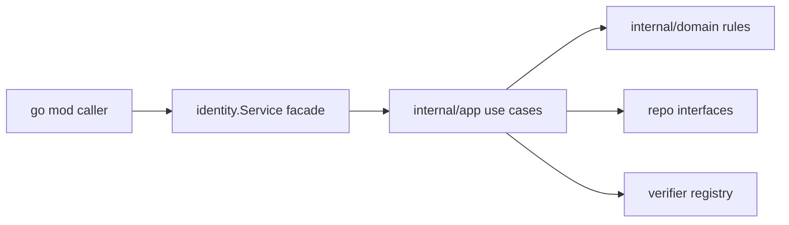

# Identity Core Facade Design

## 0. 术语约定

| 术语 | 定义 | 防冲突结论 |
|---|---|---|
| Identity Core | 该 Go module 对外暴露的无头身份能力门面，负责组织查询或创建主体、验证、绑定、作废解绑、查询单个凭据和枚举凭据等能力 | 仓库内未发现其它模块或文档复用同名概念 |
| Revoked Credential | 已解绑但仍保留记录的凭据状态，用于审计、去重和避免物理删除带来的追溯丢失 | 该概念为本次 feature 新增，用来精确定义“解绑不删，而是作废” |
| Realm | 账号池的物理隔离边界，同一标识在不同 Realm 下映射到不同 subject | 仓库内未发现同义替代命名；设计中坚持不用 tenant/app 命名 |
| Subject ID | 系统内部的全局主体标识，由 ID 生成器提供 | 仓库内未发现其他 ID 语义冲突 |
| Credential | 挂在 subject 上的原子认证因子，覆盖密码、三方标识、TOTP 等 | 仓库内未发现“账户”“登录方式”等并列定义 |
| Facade | 暴露给 `go mod` 使用方的稳定 API 层，只保留用例级入口，不暴露编排细节和基础设施实现 | 仓库内还没有现成公开 API；本次新增该概念用于约束 public surface |

术语检查结果：未发现现有 feature、compound 或 architecture 文档中的同名冲突项。

## 1. 决策与约束

### 需求摘要

- 做什么：交付一个可被外部项目通过 `go mod` 引入的身份核心模块，提供 `GetOrInitializeSubjectID`、`VerifyCredential`、`BindCredential`、`UnbindCredential`、`ListCredentials`、`GetCredential` 六个门面能力。
- 为谁做：为上层 Auth Service、网关或业务服务提供无状态的身份核调用入口，由调用方负责流程编排、Token/Session、真实数据库接线。
- 成功标准：调用方只依赖公开包即可完成接口编排；复杂实现和默认策略落在 `internal/` 中；公开 API 明确表达仓储、哈希器、ID 生成器、时钟/验证器等依赖注入点；首批单测可覆盖正常路径和主要错误路径。
- 明确不做什么：不接入真实 MySQL/Redis；不实现 Token/Session；不存储 Profile；不增加 HTTP/RPC server；不替调用方决定登录流程；不在 public package 暴露底层仓储或复杂编排细节。

### 关键决策

- 公开包采用门面模式：根包 `identity` 暴露一个 `Service` 类型和最小化领域模型，请求方通过构造函数注入依赖后调用六个用例方法。
- 复杂度收敛到 `internal/`：验证规则、默认错误映射、密码/TOTP/第三方凭证校验分发、静默注册流程等实现放入 `internal/app`、`internal/domain`、`internal/support`，外部使用方无法直接依赖内部细节。
- 仓储抽象保持面向领域：公开包只暴露完成用例所需的接口集合，例如 `SubjectRepository`、`CredentialRepository`、`CredentialVerifierRegistry`、`IDGenerator`，不绑定 SQL 结构体或缓存实现。
- 返回值以显式结果结构体表达：六个门面方法分别返回结果对象和 `error`，业务状态字段与错误分离，避免把 `INVALID_CREDENTIAL`、`ACCOUNT_LOCKED` 等业务失败全塞进 Go error 文本。
- 首批范围优先验证可扩展性，不追求所有凭证类型一次齐全：V1 先确保密码、空输入三方凭证、TOTP 三类校验路径可被统一编排，其它类型通过注册 verifier 扩展。
- 保持 Headless 边界：公共 API 不引入 HTTP context、RPC request/response、ORM model；所有输入输出都用纯 Go 结构体。
- `UnbindCredential` 采取作废不删除策略：凭据记录保留，但状态改为 revoked/invalid，后续验证和枚举默认忽略该记录，单凭据查询可按需读取其状态。

### 被拒方案

- 被拒方案 1：把所有逻辑直接放在根包。原因：对外 surface 会泄漏实现细节，后续重构容易破坏 `go mod` 使用方。
- 被拒方案 2：先做具体 MySQL 实现再抽接口。原因：与 PRD 的“本模块不直接落库”冲突，会把仓储边界做反。
- 被拒方案 3：公开 `internal` 级别的策略对象给调用方自由拼装。原因：会让门面失去价值，调用方被迫理解内部用例编排。

### 主流程概述

正常路径：调用方构造 `identity.Service` -> 注入 subject 仓储、credential 仓储、ID 生成器和 verifier 注册表 -> 调用门面方法 -> 门面委托 `internal` 用例协调领域规则 -> 返回明确结果。

关键异常与边界：

- `VerifyCredential` 在 subject 不存在、凭证不存在、凭证校验失败、subject 冻结时返回失败结果，不发号。
- `GetOrInitializeSubjectID` 在凭证已存在时返回既有 subject；不存在时先生成 subject 再挂载凭证；若挂载时遇到并发唯一性冲突，需要回读既有凭证并返回稳定 subject。
- `BindCredential` 只允许对已存在 subject 追加凭证；唯一键冲突透出为明确业务错误。
- `UnbindCredential` 只作废凭据，不物理删除；已作废凭据再次解绑返回幂等成功或明确的已作废状态，不抛系统错误。
- `ListCredentials` 只返回有效且脱敏的凭据摘要，不暴露 `credential_data`。
- `GetCredential` 用于按凭据主键或稳定查询键返回某一种凭据的脱敏详情和当前状态，供上层查看绑定状态。

## 2. 接口契约

### 对外门面

```go
svc := identity.NewService(identity.Options{
    Subjects:    subjectRepo,
    Credentials: credentialRepo,
    IDs:         idGenerator,
    Verifiers:   verifierRegistry,
})

result, err := svc.VerifyCredential(ctx, identity.VerifyCredentialInput{
    Realm:        "admins",
    IdentityType: identity.IdentityTypePassword,
    Identifier:   "admin",
    InputData:    "123456",
})
```

```go
type Service interface {
    GetOrInitializeSubjectID(ctx context.Context, input GetOrInitializeSubjectIDInput) (GetOrInitializeSubjectIDResult, error)
    VerifyCredential(ctx context.Context, input VerifyCredentialInput) (VerifyCredentialResult, error)
    BindCredential(ctx context.Context, input BindCredentialInput) (BindCredentialResult, error)
    UnbindCredential(ctx context.Context, input UnbindCredentialInput) (UnbindCredentialResult, error)
    ListCredentials(ctx context.Context, input ListCredentialsInput) (ListCredentialsResult, error)
    GetCredential(ctx context.Context, input GetCredentialInput) (GetCredentialResult, error)
}
```

说明：根包只暴露输入/输出 DTO、核心枚举、错误码和构造函数；具体验证策略注册、实体校验和流程拼装在 `internal/` 中完成。

### VerifyCredential

正常路径示例：

```go
result, err := svc.VerifyCredential(ctx, identity.VerifyCredentialInput{
    Realm:        "admins",
    IdentityType: identity.IdentityTypePassword,
    Identifier:   "admin",
    InputData:    "123456",
})

// result == identity.VerifyCredentialResult{
//     Success:   true,
//     SubjectID: 888,
// }
// err == nil
```

主要错误路径示例：

```go
result, err := svc.VerifyCredential(ctx, identity.VerifyCredentialInput{
    Realm:        "admins",
    IdentityType: identity.IdentityTypePassword,
    Identifier:   "admin",
    InputData:    "wrong-password",
})

// result == identity.VerifyCredentialResult{
//     Success:   false,
//     ErrorCode: identity.ErrorCodeInvalidCredential,
// }
// err == nil
```

约束：

- `Realm`、`IdentityType`、`Identifier` 必填。
- subject 冻结时返回 `ErrorCodeAccountLocked`。
- verifier 侧系统错误才返回非空 `error`。

### GetOrInitializeSubjectID

正常路径示例：

```go
result, err := svc.GetOrInitializeSubjectID(ctx, identity.GetOrInitializeSubjectIDInput{
    Realm:        "c_users",
    IdentityType: identity.IdentityTypeWechatOpenID,
    Identifier:   "o_xxx",
})

// result == identity.GetOrInitializeSubjectIDResult{
//     SubjectID:  9527,
//     IsNewUser:  true,
// }
// err == nil
```

并发回读路径示例：

```go
// 首次读不到 credential，创建 subject 后绑定时遭遇唯一性冲突
// internal 流程回读已存在 credential，并返回冲突对方的 subject_id
// result.IsNewUser == false
// err == nil
```

约束：

- 只适用于上层已完成外部凭证校验的免密场景。
- 若调用方传入需要本地比对的类型（如 PASSWORD/TOTP），返回参数错误。

### BindCredential

正常路径示例：

```go
result, err := svc.BindCredential(ctx, identity.BindCredentialInput{
    SubjectID:      888,
    Realm:          "admins",
    IdentityType:   identity.IdentityTypeTOTP,
    Identifier:     "totp_device_1",
    CredentialData: "encrypted-secret",
})

// result.Success == true
// err == nil
```

错误路径示例：

```go
// subject 不存在 -> result.Success == false, result.ErrorCode == identity.ErrorCodeSubjectNotFound
// 唯一性冲突 -> result.Success == false, result.ErrorCode == identity.ErrorCodeCredentialConflict
```

约束：

- 不在门面层做哈希算法选择；调用方应传入已按策略处理后的 `CredentialData`，或通过可选 helper 完成转换。
- 只允许为已存在 subject 绑定凭证。

### UnbindCredential

正常路径示例：

```go
result, err := svc.UnbindCredential(ctx, identity.UnbindCredentialInput{
    SubjectID:     888,
    Realm:         "admins",
    IdentityType:  identity.IdentityTypeTOTP,
    Identifier:    "totp_device_1",
    Reason:        "user-disabled-2fa",
})

// result.Success == true
// result.Revoked == true
// err == nil
// 来源：本次接口能力调整，“解绑不删，而是作废”
```

错误路径示例：

```go
// 未找到有效凭据 -> result.Success == false, result.ErrorCode == identity.ErrorCodeCredentialNotFound
// subject 不存在 -> result.Success == false, result.ErrorCode == identity.ErrorCodeSubjectNotFound
// 来源：本次接口能力调整
```

约束：

- 解绑不物理删除记录，只更新凭据状态为 revoked。
- 已作废凭据不再允许通过 `VerifyCredential` 验证成功。
- 是否允许重复解绑，本次定为幂等成功，并在结果中返回 `Revoked=false` 表示原本已作废。

### ListCredentials

正常路径示例：

```go
result, err := svc.ListCredentials(ctx, identity.ListCredentialsInput{
    SubjectID: 888,
    Realm:     "admins",
})

// result.Items == []identity.CredentialSummary{
//     {Type: identity.IdentityTypePassword, Identifier: "admin"},
//     {Type: identity.IdentityTypeTOTP, Identifier: "totp_device_1"},
// }
// err == nil
```

约束：

- 输出中禁止出现 `CredentialData`、哈希值、密钥明文等敏感字段。
- 不存在 subject 时返回空列表还是显式错误，本次定为显式错误 `ErrorCodeSubjectNotFound`，避免调用方把不存在误判为“未开启 2FA”。
- 默认仅返回有效凭据，不返回已作废记录。

### GetCredential

正常路径示例：

```go
result, err := svc.GetCredential(ctx, identity.GetCredentialInput{
    SubjectID:     888,
    Realm:         "admins",
    IdentityType:  identity.IdentityTypeTOTP,
    Identifier:    "totp_device_1",
})

// result.Item == identity.CredentialDetail{
//     Type:       identity.IdentityTypeTOTP,
//     Identifier: "totp_device_1",
//     Status:     identity.CredentialStatusRevoked,
// }
// err == nil
// 来源：本次接口能力调整
```

错误路径示例：

```go
// 未找到凭据 -> result.ErrorCode == identity.ErrorCodeCredentialNotFound
// 来源：本次接口能力调整
```

约束：

- 该接口返回某一种凭据的脱敏详情，可用于读取已作废状态。
- 输出中禁止出现 `CredentialData`、哈希值、密钥明文等敏感字段。

### 内部分层约束

```text
identity/                 // public facade and DTOs
internal/domain/          // entities, enums, business errors, repository contracts used internally
internal/app/             // use cases for get-or-init/verify/bind/unbind/list/get
internal/support/         // verifier registry, helper adapters, validation
```



来源：本次 feature 的模块落位决策，依据模块的 headless 和仓储分离边界。

## 3. 实现提示

### 改动计划

- 新建根包公共类型：定义 `Service`、`Options`、六组输入输出 DTO、错误码、凭据状态和基础枚举。
- 新建 `internal/domain`：定义 subject、credential、状态判断、业务错误和仓储接口。
- 新建 `internal/support`：定义 verifier 注册表及密码/TOTP/免密类型分发约束。
- 新建 `internal/app`：分别实现 get-or-init、verify、bind、unbind、list、get 六个用例服务，由门面统一组装。
- 新建门面构造与薄包装：`identity.NewService` 负责参数校验、组装内部用例并转发方法调用。
- 新建单元测试：覆盖六个公开方法的正常路径、业务失败路径、解绑作废语义和 get-or-init 的并发冲突回读语义。

### 实现风险与约束

- 不要把 repository interface 同时放在 public 和 internal 各写一份，避免双份契约漂移；本次由 public package 暴露最小依赖接口，internal 直接消费同一份定义。
- 不要为未来所有 credential 类型提前抽象过深；verifier 注册表只支持当前需要的统一调用协议即可。
- `GetOrInitializeSubjectID` 的并发冲突处理必须明确，否则调用方会拿到不稳定 subject。
- 凭据状态机需要一开始就定清楚，至少区分 active 和 revoked，避免后续 `VerifyCredential`、`ListCredentials`、`GetCredential` 各自解释不一致。
- 对外错误码必须稳定，内部错误可通过包内映射扩展，但不要把 `errors.New("...")` 字符串作为契约。

### 推进顺序

1. 定义根包公开枚举、错误码、输入输出 DTO 和依赖接口；退出信号：外部调用方能仅通过公共类型表达六个用例输入输出。
2. 实现 `internal/domain` 实体与规则校验；退出信号：subject/credential/业务错误可被内部用例直接消费，且无基础设施依赖。
3. 实现 verifier 注册表与输入校验辅助；退出信号：密码、TOTP、免密类型的分派规则可独立测试，且作废凭据会被统一拒绝验证。
4. 实现 `VerifyCredential`、`ListCredentials` 与 `GetCredential` 用例；退出信号：能覆盖查询、锁定校验、校验成功/失败、脱敏枚举和单凭据状态读取。
5. 实现 `BindCredential`、`UnbindCredential` 与 `GetOrInitializeSubjectID` 用例；退出信号：能覆盖新增绑定、作废解绑、唯一性冲突、静默发号和并发回读路径。
6. 实现根包门面构造和公开方法转发；退出信号：调用方只依赖 `identity.NewService` 即可触达六个能力。
7. 补齐面向公开 API 的单元测试；退出信号：`go test ./...` 通过，并覆盖主要业务分支和作废状态语义。

### 测试设计

- 功能点：`VerifyCredential`
  - 验证方式：用 stub repository + stub verifier 驱动。
  - 关键用例骨架：成功返回 subject；密码错误返回 `INVALID_CREDENTIAL`；subject 冻结返回 `ACCOUNT_LOCKED`；凭据已作废时返回 `CREDENTIAL_REVOKED` 或等价业务错误；verifier 内部报错返回非空 `error`。
- 功能点：`GetOrInitializeSubjectID`
  - 验证方式：模拟凭证已存在、完全新建、绑定时唯一性冲突三条路径。
  - 关键用例骨架：已有 credential 返回老 subject 且 `IsNewUser=false`；新建成功返回新 subject 且 `IsNewUser=true`；冲突后回读稳定返回既有 subject。
- 功能点：`BindCredential`
  - 验证方式：模拟 subject 缺失、绑定成功、唯一性冲突。
  - 关键用例骨架：不存在 subject 返回 `SUBJECT_NOT_FOUND`；冲突返回 `CREDENTIAL_CONFLICT`。
- 功能点：`UnbindCredential`
  - 验证方式：模拟首次作废、重复解绑、subject 缺失、凭据不存在。
  - 关键用例骨架：有效凭据解绑后状态改为 revoked；重复解绑保持幂等；不存在 subject 返回 `SUBJECT_NOT_FOUND`；不存在凭据返回 `CREDENTIAL_NOT_FOUND`。
- 功能点：`ListCredentials`
  - 验证方式：模拟多凭证返回值。
  - 关键用例骨架：返回值仅包含 `Type` 和 `Identifier`；已作废凭据不会出现在列表；不存在 subject 返回 `SUBJECT_NOT_FOUND`。
- 功能点：`GetCredential`
  - 验证方式：模拟有效凭据、已作废凭据、未命中凭据。
  - 关键用例骨架：返回脱敏详情和状态字段；已作废凭据可被读到 revoked 状态；未命中返回 `CREDENTIAL_NOT_FOUND`。
- 功能点：门面组装
  - 验证方式：空依赖和缺失关键依赖时构造失败。
  - 关键用例骨架：`Options` 缺必需依赖返回参数错误，避免运行期 nil panic。

## 4. 与项目级架构文档的关系

- 关联文档：当前只有 `easysdd/architecture/DESIGN.md` 骨架，总入口尚未记录 identity 模块结构。
- 本 feature 实现完成并通过 acceptance 后，应补一份 `easysdd/architecture/module-identity-core.md`，描述 public facade 与 `internal` 分层、依赖注入边界及扩展点。
- 同时需要在 `easysdd/architecture/DESIGN.md` 的“子系统 / 模块索引”中加入 identity core 条目。

---

方案 doc 已起草完成，请整体 review：
1. 术语有没有和已有概念冲突？
2. 决策与约束是否准确，“不做什么”有没有遗漏？
3. 契约示例是否覆盖了你关心的正常 + 异常场景？
4. 推进步骤和测试设计是否可执行？

有修改意见直接说，确认后进入实现阶段。
