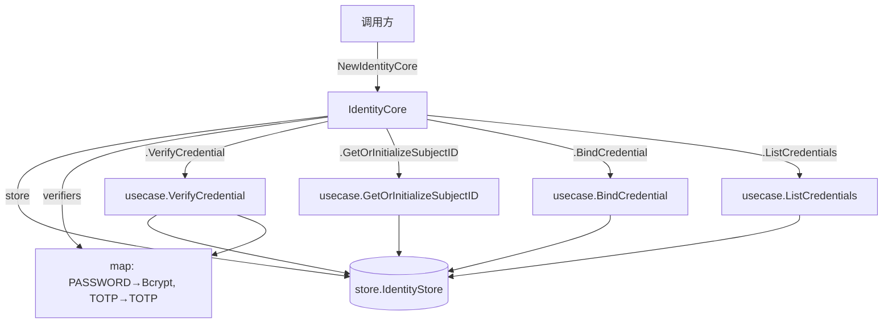

# core-api Design

> 来源：`codestable/roadmap/identity-core/identity-core-roadmap.md` §4.7（硬约束）
> 前置：f2 password-verify ✅ / f3 totp-auth ✅ / f4 credential-crud ✅

## 0. 术语表

沿用 f1-f4 全部术语。新增：

| 术语 | 定义 | 类型 |
|------|------|------|
| IdentityCore | 库的公共入口结构体，组合 IdentityStore + Verifier map，将 4 个 usecase 暴露为方法 | struct（根包） |
| NewIdentityCore | 构造函数，接收 IdentityStore，内置默认 Verifier map | func（根包） |

## 1. 决策与约束

### 1.1 在项目结构中的位置

**现状**：根包有 `model.go`、`errors.go`、`store.go`、`api.go`。`usecase/` 下有 4 个编排函数。调用方当前需自行组合 store + verifiers + usecase 函数。

**本次放置**：
- 新增 `core/core.go` — `IdentityCore` struct + `NewIdentityCore` 构造函数 + 4 个方法

**放置理由**：根包 `identity` 同时 import `usecase` 和 `internal/crypto` 会产生 import cycle（两者均 import 根包）。`core/` 包作为同级子包可自由 import 三者而无 cycle。这是对 roadmap §4.7 的澄清——roadmap 画了根包布局但实现时发现 Go 编译器约束不允许。导入路径变为 `github.com/modern-magic-go/identity/core`，对外契约不变（类型 / 方法签名完全一致）。

### 1.2 明确不做

- 不新增 usecase 编排逻辑——IdentityCore 的方法是单纯的委托，不动编排
- 不新增 store 方法 / 接口
- 不新增 crypto 能力
- 不暴露 `crypto.CredentialVerifier` 接口为公开——内部接口保持 internal，调用方通过构造函数获得默认 verifier（Bcrypt + TOTP）
- 不提供 Verifier 动态注册——本次不开放扩展点，未来 feature 可追加

### 1.3 关键设计决策

**D1：IDGenerator 不存于 IdentityCore**

Roadmap §4.7 注释提到"内部组合：IdentityStore + IDGenerator + map[IdentityType]CredentialVerifier"，但代码实际中 IDGenerator 由 store 实现内部持有（`MockStore.idGen`），usecase 通过 `store.CreateSubject` 间接使用。IdentityCore 不直接接触 IDGenerator——这是对 roadmap 注释的澄清，不影响对外契约。

**D2：Verifier map 内建默认值，不暴露为构造参数**

```go
func NewIdentityCore(store identity.IdentityStore) *IdentityCore
```

构造函数内建 `TypePassword → Bcrypt` + `TypeTOTP → TOTP`。调用方不需要理解 verifier 机制——这两个够覆盖库当前支持的校验类型。其他类型（WECHAT_OPENID、SMS 等）的"校验"由调用方在外部完成，库只负责存储。

**D3：方法签名与现有 usecase 函数保持一致**

```go
func (c *IdentityCore) VerifyCredential(ctx context.Context, input identity.VerifyInput) (identity.VerifyOutput, error)
func (c *IdentityCore) GetOrInitializeSubjectID(ctx context.Context, input identity.GetOrInitSubjectInput) (identity.GetOrInitSubjectOutput, error)
func (c *IdentityCore) BindCredential(ctx context.Context, input identity.BindCredentialInput) error
func (c *IdentityCore) ListCredentials(ctx context.Context, input identity.ListCredentialsInput) ([]identity.CredentialSummary, error)
```

比 usecase 函数少了一个 `store` 参数——store 已内置于 IdentityCore。

**D4：方法实现为纯委托，不重复编排逻辑**

每个方法内部直接调用对应的 usecase 函数，不复制逻辑。保证"唯一真相来源"在 usecase 层。

### 1.4 复杂度档位

与 f1-f4 一致。无新增偏离。

| 维度 | 档位 | 说明 |
|------|------|------|
| 可观测性 | opaque | 与 f1-f4 一致，日志留给调用方 |
| 并发 | single-threaded | struct 无锁，调用方控制并发 |

## 2. 名词与编排

### 2.1 名词层

**现状**：4 个 usecase 函数 + 6 个 API 入/出参类型均已就位。调用方需构造 `map[IdentityType]crypto.CredentialVerifier` 并调用 usecase 函数。

**变化**：

#### 新增 IdentityCore 结构体（`core/core.go`）

```go
package core

// IdentityCore 库的公共入口，聚合 store 和 verifier map，对外暴露 4 个方法
type IdentityCore struct {
    store     identity.IdentityStore
    verifiers map[identity.IdentityType]crypto.CredentialVerifier
}
```

**接口示例**：

```go
// 来源：core/core.go NewIdentityCore
store := store.NewMockStore(snowflake)
core := core.NewIdentityCore(store)

// 来源：identity.go VerifyCredential
out, err := core.VerifyCredential(ctx, identity.VerifyInput{
    Realm:        "users",
    IdentityType: identity.TypePassword,
    Identifier:   "alice",
    InputData:    "secret123",
})
// 成功 → VerifyOutput{Success: true, SubjectID: 123}
// 密码错 → VerifyOutput{Success: false, ErrorCode: "INVALID_CREDENTIAL"}
// 未找到 → VerifyOutput{Success: false, ErrorCode: "CREDENTIAL_NOT_FOUND"}

// 来源：identity.go GetOrInitializeSubjectID
out, err := core.GetOrInitializeSubjectID(ctx, identity.GetOrInitSubjectInput{
    Realm:        "users",
    IdentityType: identity.TypePassword,
    Identifier:   "newuser",
})
// 新用户 → GetOrInitSubjectOutput{SubjectID: 456, IsNewUser: true}
// 已有 → GetOrInitSubjectOutput{SubjectID: 456, IsNewUser: false}

// 来源：identity.go BindCredential
err := core.BindCredential(ctx, identity.BindCredentialInput{
    SubjectID:      123,
    Realm:          "admins",
    IdentityType:   identity.TypeTOTP,
    Identifier:     "totp_dev",
    CredentialData: "base32secret...",
})
// 成功 → nil
// 重复 → errors.Is(err, identity.ErrDuplicateCredential)
// subject 不存在 → errors.Is(err, identity.ErrSubjectNotFound)

// 来源：identity.go ListCredentials
list, err := core.ListCredentials(ctx, identity.ListCredentialsInput{
    SubjectID: 123,
    Realm:     "admins",
})
// 有凭证 → []CredentialSummary{{Type:"PASSWORD", Identifier:"admin"}, ...}, nil
// 无/不存在 → []CredentialSummary{}, nil
```

### 2.2 编排层

**现状**：4 个 usecase 函数为纯函数，调用方手动组合 `store + verifiers + input`。没有 struct 封装。

**主流程图**：



**线性拓扑**——IdentityCore 是 4 条线性委托链的容器，本身无编排逻辑。

**变化**：

| 变化 | 描述 |
|------|------|
| 新增 `IdentityCore` struct | 聚合 `store` + `verifiers` map |
| 新增 `NewIdentityCore` | 构造 IdentityCore，内建 Bcrypt + TOTP verifier |
| 新增 4 个方法 | 每个委托对应 usecase 函数，去掉 store 参数 |

**跨层纪律**：无新增。错误语义、幂等性、并发约定均沿用 usecase 层现有纪律。IdentityCore 不引入新约束。

### 2.3 挂载点

| # | 挂载点 | 动作 | 说明 |
|---|--------|------|------|
| 1 | `core/core.go` — `IdentityCore` struct | 新增 | 库的公共入口类型 |
| 2 | `core/core.go` — `NewIdentityCore(store) *IdentityCore` | 新增 | 唯一构造函数 |
| 3 | `core/core.go` — 4 个方法 | 新增 | 对外暴露的 API 方法 |

### 2.4 推进策略

```
1. 结构体骨架：core/core.go 定义 IdentityCore struct + NewIdentityCore 构造函数 + 4 个方法
   退出信号：go build ./... 编译通过

2. 委托实现：4 个方法填充为 usecase 函数调用
   退出信号：编译通过 + 已有 usecase 测试继续全绿

3. 集成测试：PRD 5.1 双因素场景（密码+TOTP）通过 IdentityCore 方法端到端跑通
   退出信号：core_api_test.go 中密码+TOTP 完整流程 PASS

4. 测试覆盖：补齐用 IdentityCore 方法的绑定→列表→校验完整生命周期
   退出信号：所有验收场景有可观察证据
```

## 3. 验收契约

### 正常路径

| # | 输入 / 触发 | 期望可观察结果 |
|---|-------------|---------------|
| C1 | `NewIdentityCore(store)` → 调用 4 个方法 | 全部编译通过，无 panic |
| C2 | `core.VerifyCredential(ctx, {PASSWORD, "alice", "correct"})` | `Success=true`, SubjectID 非零 |
| C3 | `core.GetOrInitializeSubjectID(ctx, {PASSWORD, "newuser"})` | `IsNewUser=true`, SubjectID 非零 |
| C4 | `core.BindCredential(ctx, {subj, TOTP, "totp_dev", secret})` | 返回 nil |
| C5 | `core.ListCredentials(ctx, {subj, "realm"})` | 返回 `[]CredentialSummary`，含先前绑定的所有凭证 |

### 边界与错误

| # | 输入 / 触发 | 期望可观察结果 |
|---|-------------|---------------|
| C6 | `core.VerifyCredential` 密码错误 | `Success=false`, ErrorCode=`INVALID_CREDENTIAL` |
| C7 | `core.VerifyCredential` 凭证未找到 | `Success=false`, ErrorCode=`CREDENTIAL_NOT_FOUND` |
| C8 | `core.BindCredential` 重复绑定 | `errors.Is(err, ErrDuplicateCredential)` 为 true |
| C9 | `core.BindCredential` subject 不存在 | `errors.Is(err, ErrSubjectNotFound)` 为 true |
| C10 | `core.ListCredentials` 无凭证 | 返回空切片，nil error |

### 集成测试（PRD 5.1 场景）

| # | 输入 / 触发 | 期望可观察结果 |
|---|-------------|---------------|
| C11 | 完整双因素流程：创建 subject → 绑定密码 → 绑定 TOTP → Verify PASSWORD 成功 → ListCredentials 发现 TOTP → Verify TOTP 成功 | 两步 Verify 均 Success=true，SubjectID 一致 |

### 明确不做反向核对

| 不做项 | 反向核对 |
|--------|---------|
| 无新增 usecase 编排 | `diff usecase/` 仅 `get_or_init_subject.go` 为 f4 改动（旁路纠正），本 feature 不碰 usecase |
| 无新增 store 接口/方法 | `diff store.go` zero change |
| 无新增 crypto | `diff internal/crypto/` zero change |
| 不暴露 CredentialVerifier 接口 | 接口定义保持在 `internal/crypto/verifier.go`，根包不新增公开接口 |

## 4. 与项目级架构文档的关系

### 新增模块

- `core/` 包 — IdentityCore struct + NewIdentityCore + 4 方法（因 import cycle 约束无法放根包，详见 §1.1）

### 架构 doc 更新提示

`ARCHITECTURE.md` 需新增：
- 新增模块条目：`core/` 包 — IdentityCore 结构体 + 构造函数 + 4 方法
- 实现状态表 `core-api` 行：`⬜ planned` → `✅ done`
- 状态行："所有 5 条子 feature 完成"

### 后续

本 feature 是 identity-core roadmap 的最后一条——完成即整体闭环。
