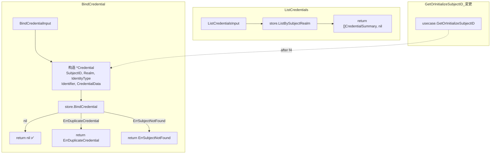

# credential-crud Design

> 来源：`codestable/roadmap/identity-core/identity-core-roadmap.md` §4 接口契约（硬约束）
> 前置：f1 `domain-and-crypto` done — 类型 / 接口 / 错误哨兵均就位

## 0. 术语表

沿用 f1-f3 全部术语，本 feature 不断增新术语。

## 1. 决策与约束

### 1.1 在项目结构中的位置

**现状**：根包有 `api.go`（VerifyInput/Output 等），`usecase/` 有 `verify_credential.go` 和 `get_or_init_subject.go`。`IdentityStore` 接口已有 `BindCredential` 和 `ListBySubjectRealm` 方法，`MockStore` 均已实现。

**本次放置**：
- 新增 `usecase/bind_credential.go` — BindCredential 编排函数
- 新增 `usecase/list_credentials.go` — ListCredentials 编排函数
- 追加 `api.go` — BindCredentialInput / ListCredentialsInput 类型
- 重构 `usecase/get_or_init_subject.go` — 将内部 `store.BindCredential` 调用切换为 `BindCredential`

**放置理由**：usecase 层作为编排的唯一入口。现有 `GetOrInitializeSubjectID` 直调 `store.BindCredential`，绕过编排层——本次纠正这条"旁路"，让所有凭证操作路由经过 usecase。

### 1.2 明确不做

- 不提供 IdentityCore 结构体 / NewIdentityCore 构造函数——那是 f5
- 不新增 store 方法——`IdentityStore` 接口已完备
- 不新增 crypto 能力——bcrypt、TOTP 归 f1/f3
- 不处理 credential 更新/删除——PRD 未定义 UpdateCredential / RemoveCredential
- 不处理 subject 冻结状态（AccountLocked）——与 f2 一致，待 roadmap update

### 1.3 关键设计决策

**D1：usecase 函数形态——纯函数，与 f2 一致**

```go
func BindCredential(ctx context.Context, store identity.IdentityStore, input identity.BindCredentialInput) error
func ListCredentials(ctx context.Context, store identity.IdentityStore, input identity.ListCredentialsInput) ([]identity.CredentialSummary, error)
```

无返回值包装 struct——`BindCredential` 成功返回 nil，失败返回哨兵错误（`ErrDuplicateCredential` / `ErrSubjectNotFound`）。调用方通过 `errors.Is` 判断。

**D2：GetOrInitializeSubjectID 旁路纠正**

现状 `get_or_init_subject.go:40` 直调 `store.BindCredential`。f4 之后改为调用 `usecase.BindCredential`，让编排层成为凭证操作的唯一入口。行为不变——`GetOrInitializeSubjectID` 创建 user 时仍以空 `CredentialData` 绑定凭证。

**D3：ListCredentials 空结果返回空切片**

对照 `MockStore.ListBySubjectRealm` 现状——subject 无凭证或不存在均返回空切片 + nil error。usecase 不做 subject 存在性预查（避免额外 store 调用）。

**D4：错误语义——store 哨兵直透**

`BindCredential` 不做错误翻译——store 返回的 `ErrDuplicateCredential` / `ErrSubjectNotFound` 直接透传。调用方通过 `errors.Is` 匹配，与 VerifyCredential / GetOrInitializeSubjectID 的 ErrorCode 模式不同（因为 BindCredential 无 Success/ErrorCode/Msg 结构的输出契约，PRD 定义返回"Success 或唯一性冲突报错"）。

### 1.4 复杂度档位

走"对外发布的库/服务"默认档位：L3 + modules + budgeted + public + tested + validated。无新增偏离。

| 维度 | 档位 | 说明 |
|------|------|------|
| 可观测性 | opaque | 与 f1-f3 一致，日志由 f5 注入 |
| 并发 | single-threaded | 纯函数，无共享状态 |

## 2. 名词与编排

### 2.1 名词层：值对象 / 实体 / 接口契约

**现状**（来源：`api.go:3` / `store.go:5`）：

- `api.go` 已有 `VerifyInput` / `VerifyOutput` / `GetOrInitSubjectInput` / `GetOrInitSubjectOutput`
- `IdentityStore` 接口已有 `BindCredential(ctx, cred *Credential) error` 和 `ListBySubjectRealm(ctx, subjectID, realm) ([]CredentialSummary, error)`
- `errors.go` 已有 `ErrDuplicateCredential` / `ErrSubjectNotFound` / `ErrCredentialNotFound`

**变化**：

#### 新增 API 输入类型（根包 `api.go`）

```go
// BindCredentialInput 绑定凭证入参
type BindCredentialInput struct {
    SubjectID      int64        // 目标 subject
    Realm          string       // 领域
    IdentityType   IdentityType // 凭证类型
    Identifier     string       // 标识符
    CredentialData string       // 需加密存储的凭证数据（bcrypt hash / TOTP secret），第三方登录可为空
}

// ListCredentialsInput 列出凭证入参
type ListCredentialsInput struct {
    SubjectID int64  // 目标 subject
    Realm     string // 领域
}
```

**接口示例**：

```go
// 来源：usecase/bind_credential.go BindCredential
// 正常路径
BindCredential(ctx, store, BindCredentialInput{
    SubjectID:      123,
    Realm:          "admins",
    IdentityType:   TypeTOTP,
    Identifier:     "totp_device_1",
    CredentialData: base32Secret,
}) → nil

// 唯一性冲突
BindCredential(ctx, store, BindCredentialInput{
    SubjectID:      123,
    Realm:          "admins",
    IdentityType:   TypePassword,
    Identifier:     "admin",     // 该 Realm+Type+Identifier 已存在
    CredentialData: hash,
}) → errors.Is(err, ErrDuplicateCredential) == true

// subject 不存在
BindCredential(ctx, store, BindCredentialInput{
    SubjectID:      999,         // 不存在
    Realm:          "admins",
    IdentityType:   TypePassword,
    Identifier:     "new",
    CredentialData: hash,
}) → errors.Is(err, ErrSubjectNotFound) == true
```

```go
// 来源：usecase/list_credentials.go ListCredentials
// 有凭证
ListCredentials(ctx, store, ListCredentialsInput{
    SubjectID: 123,
    Realm:     "admins",
}) → []CredentialSummary{
         {Type: "PASSWORD", Identifier: "admin"},
         {Type: "TOTP", Identifier: "totp_device_1"},
       }, nil

// 空结果
ListCredentials(ctx, store, ListCredentialsInput{
    SubjectID: 999,       // 不存在或无凭证
    Realm:     "empty",
}) → []CredentialSummary{}, nil
```

### 2.2 编排层：主流程与控制流

**现状**：`usecase/` 仅有两个编排函数。`GetOrInitializeSubjectID` 内部直调 `store.BindCredential`（`get_or_init_subject.go:40`），不经过 usecase 编排层。

**主流程图**：



**线性拓扑**——两个 usecase 均为 2 步线性序列。

**变化**：

| 变化 | 描述 |
|------|------|
| 新增 `BindCredential` 编排 | 从 `BindCredentialInput` 构造 `*Credential` → 调用 `store.BindCredential` → 返回 error |
| 新增 `ListCredentials` 编排 | 从 `ListCredentialsInput` 提取 `subjectID` / `realm` → 调用 `store.ListBySubjectRealm` → 返回结果 |
| 重构 `GetOrInitializeSubjectID` | 第 40 行 `store.BindCredential` 调用改为 `BindCredential(ctx, store, ...)`，行为不变 |

**跨层纪律**：

| 维度 | 约定 |
|------|------|
| 错误语义 | store 哨兵直透——`ErrDuplicateCredential` / `ErrSubjectNotFound` 不经包装抛出 |
| 幂等性 | `BindCredential` 非幂等（重复调用返回 `ErrDuplicateCredential`）；`ListCredentials` 幂等 |
| 并发/顺序 | 纯函数，无共享状态，调用方控制并发 |
| 扩展点 | 无——本 feature 不开放扩展点 |
| 可观测点 | 无——与 f1-f3 一致，f5 统一注入日志 |

### 2.3 挂载点

按"删了它 feature 是否消失"判据：

| # | 挂载点 | 动作 | 说明 |
|---|--------|------|------|
| 1 | `usecase/bind_credential.go` — `BindCredential` 函数 | 新增 | 供 f5 包裹进 IdentityCore，替代调用方直调 store |
| 2 | `usecase/list_credentials.go` — `ListCredentials` 函数 | 新增 | 供 f5 包裹进 IdentityCore |
| 3 | `api.go` — `BindCredentialInput` / `ListCredentialsInput` 类型 | 新增 | 调用方构造入参的类型定义 |
| 4 | `usecase/get_or_init_subject.go` — `GetOrInitializeSubjectID` | 修改内部调用 | 从 `store.BindCredential` 切为 `BindCredential` |

### 2.4 推进策略

按 paradigm 维度切片：

```
1. API 类型定义：api.go 新增 BindCredentialInput / ListCredentialsInput
   退出信号：go build ./... 编译通过

2. BindCredential 编排：usecase/bind_credential.go
   退出信号：成功绑定返回 nil、重复返回 ErrDuplicateCredential、subject 不存在返回 ErrSubjectNotFound

3. ListCredentials 编排：usecase/list_credentials.go
   退出信号：有凭证返回列表、无凭证/不存在 subject 返回空切片

4. 旁路纠正：get_or_init_subject.go 内 bind 调用切为 usecase.BindCredential
   退出信号：已有 GetOrInitializeSubjectID 测试全部通过

5. 测试覆盖：新增 usecase 测试覆盖 BindCredential + ListCredentials 的正常/边界/错误路径
   退出信号：所有验收场景有可观察证据
```

## 3. 验收契约

### 正常路径

| # | 输入 / 触发 | 期望可观察结果 |
|---|-------------|---------------|
| C1 | `BindCredential(ctx, store, {SubjectID:123, Realm:"users", Type:PASSWORD, Identifier:"alice", CredentialData:"$2a$...hash"})` | 返回 nil；`ListBySubjectRealm(123, "users")` 包含 {PASSWORD, "alice"} |
| C2 | 同 subject 绑定多个不同类型的凭证（如 PASSWORD + TOTP） | 两次 `BindCredential` 均返回 nil；`ListCredentials(123, "users")` 返回 2 条 |
| C3 | `ListCredentials(ctx, store, {SubjectID:123, Realm:"users"})`（有凭证） | 返回 `[]CredentialSummary`，长度 = 绑定数，每条含 `Type` + `Identifier`，不含 `CredentialData` |

### 边界与错误

| # | 输入 / 触发 | 期望可观察结果 |
|---|-------------|---------------|
| C4 | `BindCredential` 同 Realm+Type+Identifier 重复绑定 | 返回 `ErrDuplicateCredential`，`errors.Is(err, ErrDuplicateCredential)` 为 true |
| C5 | `BindCredential` 的 SubjectID 不存在 | 返回 `ErrSubjectNotFound`，`errors.Is(err, ErrSubjectNotFound)` 为 true |
| C6 | `ListCredentials` target subject 无凭证 | 返回空切片 `[]`，nil error |
| C7 | `ListCredentials` target subject 不存在 | 返回空切片 `[]`，nil error |

### 旁路纠正验证

| # | 输入 / 触发 | 期望可观察结果 |
|---|-------------|---------------|
| C8 | 调用 `GetOrInitializeSubjectID`（新用户）后 `ListCredentials` 新 subject | 返回 1 条凭证摘要，`Type` 和 `Identifier` 与入参匹配 |
| C9 | 运行已有 `TestGetOrInitSubjectNewUser` / `TestGetOrInitSubjectExistingUser` | 全部通过（行为不变） |

### 明确不做反向核对

| 不做项 | 反向核对 |
|--------|---------|
| 无 IdentityCore struct | `grep "type IdentityCore struct"` zero match |
| 无新增 store 方法/接口变动 | `diff` 仅涉及 `api.go` + `usecase/`，`store.go` 无变化 |
| 无 credential 更新/删除 | `grep "UpdateCredential\|DeleteCredential\|RemoveCredential"` zero match |
| 无真实 DB 连接 | `grep` 无 MySQL/Redis 连接代码 |

## 4. 与项目级架构文档的关系

### 新增模块

- `usecase/bind_credential.go` — BindCredential 编排函数
- `usecase/list_credentials.go` — ListCredentials 编排函数
- `api.go` 新增 2 个 struct（BindCredentialInput / ListCredentialsInput）

### 架构 doc 更新提示

`ARCHITECTURE.md` 需新增：
- `usecase/` 模块条目下追加 `bind_credential.go` + `list_credentials.go`
- 实现状态表 `credential-crud` 行：`⬜ planned` → `✅ done`

### 后续 feature 依赖

- f5 `core-api` 消费本 feature 的 `BindCredential` / `ListCredentials` 函数，包裹进 `IdentityCore` 结构体
