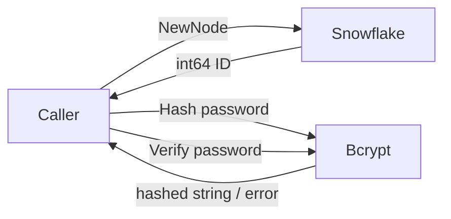

# domain-and-crypto Design

> 来源：`codestable/roadmap/identity-core/identity-core-roadmap.md` §4 接口契约（硬约束）
> 需求：`codestable/requirements/prd.md`

## 0. 术语表

| 术语 | 定义 | 类型 |
|------|------|------|
| SubjectID | 全局唯一用户标识，由 Snowflake 算法生成 | `= int64`（类型别名） |
| Realm | 账号池物理隔离单位（如 `c_users`、`b_admins`） | `= string` |
| IdentityType | 凭证类别枚举（PASSWORD / TOTP / WECHAT_OPENID 等） | `string` 类型别名 + 常量 |
| Credential | 原子凭证：记录一个 subject 在某 Realm 下的某种登录方式 | struct |
| CredentialSummary | 凭证摘要（脱敏后不含 CredentialData） | struct |
| IdentityStore | 持久化层合约接口，4 方法按业务操作命名 | interface |
| IDGenerator | 全局 ID 生成器内部接口 | interface（`internal/idgen`） |
| CredentialVerifier | 凭证校验策略内部接口，按 IdentityType 注册 | interface（`internal/crypto`） |

## 1. 决策与约束

### 1.1 在项目结构中的位置

**放置判断**：本次建的是全库的基石层——其他所有 feature 都依赖这里的类型和接口。放在根包 + `internal/` 子包下。

- 根包 `github.com/modern-magic-go/identity`：公开类型 + 公开接口（调用方可见）
- `internal/crypto/`：bcrypt 实现 + CredentialVerifier 接口（库内部消费）
- `internal/idgen/`：Snowflake 实现 + IDGenerator 接口（库内部消费）

### 1.2 明确不做

- 不实现任何业务编排（VerifyCredential / GetOrInitializeSubjectID 等）——那是 f2-f4 的职责
- 不引入 TOTP——f3 负责
- 不实现真实的 MySQL/Redis 存储——IdentityStore 只是接口，Mock 实现在 f2
- 不处理并发安全——Snowflake 自带线程安全，bcrypt 是纯函数，本 feature 无共享状态

### 1.3 复杂度档位

场景：**对外发布库**

| 维度 | 档位 | 说明 |
|------|------|------|
| 健壮性 | L3 严防 | 所有外部输入校验、所有错误路径明确返回、bcrypt cost 下限 |
| 结构 | modules | 根包 + 2 个 internal 子包，职责清晰 |
| 性能 | budgeted | bcrypt cost 可配置（默认 10），Snowflake 零争用 |
| 可读性 | public | 公开 API 带 godoc 注释，类型命名自文档 |
| 可演进性 | active | 后续 feature 会在此基础上扩展接口和实现 |
| 可测试性 | tested | 每个公开函数/接口方法必须有单测 |
| 安全性 | validated | 密码输入不可为空字符串，bcrypt cost 不低于 4（PRD 建议 ≥10） |

**偏离标记**：
- 可观测性：本 feature 走 **opaque**（无日志）。日志在 f5 组装层统一注入，基础层不自行决定日志策略
- 并发：Snowflake 走 **thread-safe**（库自带），其余纯函数默认 **single-threaded**（调用方控制）

### 1.4 前置依赖

需先加到 `go.mod`：
- `github.com/bwmarrin/snowflake` — Snowflake ID 算法
- `golang.org/x/crypto` — bcrypt 实现

## 2. 编排-计算分离视图

### 2.1 名词层

**现状**：项目为空。`go.mod` 声明了 module 路径，无 Go 源文件。

**变化**：

#### 公开类型（根包 `identity`）

```go
// model.go

type SubjectID = int64
type Realm     = string

type IdentityType string

const (
    TypePassword      IdentityType = "PASSWORD"
    TypeWechatOpenID  IdentityType = "WECHAT_OPENID"
    TypeWechatUnionID IdentityType = "WECHAT_UNIONID"
    TypeEmail         IdentityType = "EMAIL"
    TypeTOTP          IdentityType = "TOTP"
    TypeSMS           IdentityType = "SMS"
)

type Credential struct {
    SubjectID      int64        // 关联的 subject
    Realm          string       // 所属领域
    IdentityType   IdentityType // 凭证类型
    Identifier     string       // 外部标识（手机号 / 用户名 / OpenID）
    CredentialData string       // 加密存储的凭证数据，第三方登录可为空
}

type CredentialSummary struct {
    Type       IdentityType // 凭证类型（脱敏后不含敏感数据）
    Identifier string       // 标识符
}
```

#### 错误哨兵（根包 `identity`）

```go
// errors.go

var (
    ErrInvalidCredential   = errors.New("identity: invalid credential")
    ErrAccountLocked       = errors.New("identity: account locked")
    ErrDuplicateCredential = errors.New("identity: duplicate credential already exists in realm")
    ErrCredentialNotFound  = errors.New("identity: credential not found")
    ErrSubjectNotFound     = errors.New("identity: subject not found")
)
```

调用方通过 `errors.Is(err, ErrInvalidCredential)` 判断。

#### IdentityStore 接口（根包 `identity`）

```go
// store.go

type IdentityStore interface {
    FindByRealmTypeIdentifier(ctx context.Context, realm string, identityType IdentityType, identifier string) (*Credential, error)

    CreateSubject(ctx context.Context) (int64, error)

    BindCredential(ctx context.Context, cred *Credential) error

    ListBySubjectRealm(ctx context.Context, subjectID int64, realm string) ([]CredentialSummary, error)
}
```

#### 内部接口（`internal/` 包，不导出）

```go
// internal/idgen/idgen.go
// IDGenerator 全局唯一 ID 生成器
type IDGenerator interface {
    Generate() int64
}
```

```go
// internal/crypto/verifier.go
// CredentialVerifier 凭证校验策略；按 IdentityType 注册
type CredentialVerifier interface {
    Type() IdentityType
    Verify(storedData, inputData string) (bool, error)
}
```

### 2.2 编排层

本 feature **无编排**。所有产物是纯类型定义 + 纯函数式计算组件，不涉及任何跨模块调用或状态流转。

Snowflake 和 bcrypt 的调用方式如下（非编排，仅示意）：



### 2.3 挂载点

按"删了它 feature 是否消失"判据：

| # | 挂载点 | 消费方 | 说明 |
|---|--------|--------|------|
| 1 | `SubjectID` / `Realm` / `IdentityType` 类型别名 | f2-f5 | 所有 feature 的类型基础 |
| 2 | `Credential` / `CredentialSummary` 结构体 | f2-f5 + 调用方 | 调用方实现 IdentityStore 时持有 |
| 3 | `IdentityStore` 接口 | f2-f5 + 调用方 | 调用方注入实现，本库所有 usecase 依赖 |
| 4 | 5 个错误哨兵 | f2-f5 + 调用方 | usecase 返回 + 调用方匹配 |
| 5 | `internal/crypto` bcrypt Hash/Verify | f2（VerifyCredential） | 密码比对的基础能力 |
| 6 | `internal/idgen` Snowflake Generate | f2（GetOrInitializeSubjectID） | 新用户 ID 生成 |

### 2.4 推进策略

按 paradigm 维度切片，每步有独立退出信号：

1. **加依赖**：`go get` 引入 snowflake + bcrypt，验证 `go mod tidy` 通过
2. **搭建领域模型**：`model.go` + `errors.go` + `store.go`。编译通过即可验证——无行为代码
3. **实现 Snowflake**：`internal/idgen/snowflake.go`，暴露 `New(nodeID int64)` 返回 `*Snowflake`（实现 `IDGenerator`）。验证：连续生成 100 个 ID 全唯一
4. **实现 bcrypt**：`internal/crypto/bcrypt.go`，暴露 `Hash(password string, cost int) (string, error)` 和 `Verify(hashedPassword, password string) error`，同时 `*Bcrypt` 实现 `CredentialVerifier`。验证：Hash → Verify 往返通过、错误密码被拒绝
5. **测试覆盖**：Snowflake 唯一性测试 + bcrypt 往返测试 + 类型编译检查

## 3. 验收契约

### 正常路径

| # | 输入 / 触发 | 期望可观察结果 |
|---|-------------|---------------|
| C1 | `NewSnowflake(1); gen.Generate()` 连续 1000 次 | 所有 ID 互不相同，均为正 int64 |
| C2 | `BcryptHash("hello123", 10)` | 返回以 `$2a$10$` 开头的 60 字符字符串 |
| C3 | `BcryptHash("hello123", 10)` → `BcryptVerify(hash, "hello123")` | 返回 `nil`（验证通过） |
| C4 | `BcryptHash("hello123", 10)` → `BcryptVerify(hash, "wrong")` | 返回 `bcrypt.ErrMismatchedHashAndPassword` |
| C5 | 裸 `go build ./...` | 编译通过，无循环引用 |
| C6 | `errors.Is(ErrInvalidCredential, ErrInvalidCredential)` | `true` |
| C7 | `errors.Is(ErrInvalidCredential, ErrAccountLocked)` | `false`（哨兵互不相等） |

### 边界与错误

| # | 输入 / 触发 | 期望可观察结果 |
|---|-------------|---------------|
| C8 | `BcryptHash("", 10)` | 因后续 verify 会失败，允许空密码通过 Hash（库行为），但设计文档标记调用方应自行校验 |
| C9 | `BcryptHash("password", cost=3)` | 库静默将 cost 升至 MinCost(4)，正常返回 hash（不报错） |
| C10 | `NewSnowflake(nodeID=-1)` | `bwmarrin/snowflake` 的 Node 要求 0-1023，负数返回 error |
| C11 | `BcryptVerify("not-a-valid-hash", "anything")` | 非 bcrypt 格式 hash 返回 error |

### 明确不做反向核对

| 不做项 | 反向核对 |
|--------|---------|
| 无业务编排 | `grep -r "VerifyCredential\|GetOrInit"` 应 zero match |
| 无 TOTP | `grep -r "totp\|TOTP"` 应 zero match |
| 无真实存储 | 无 MySQL/Redis 连接代码 |

## 4. 对架构的反射

### 新增模块

本 feature 向项目增加：
- **根包** `identity`：公开类型定义层（model.go / store.go / errors.go）
- **`internal/idgen`**：ID 生成抽象 + Snowflake 实现
- **`internal/crypto`**：凭证校验抽象 + bcrypt 实现

不涉及已有架构 doc 改动——`ARCHITECTURE.md` 当前为骨架，由后续 acceptance 阶段统一回写。

### 后续 feature 依赖关系

f2 将消费本 feature 的全部产物——这是设计意图内的依赖。具体：
- f2 的 `VerifyCredential` 使用 `internal/crypto` 的 bcrypt.Verify
- f2 的 `GetOrInitializeSubjectID` 使用 `internal/idgen` 的 Snowflake.Generate
- f2-f5 全部导入根包的公开类型和 IdentityStore 接口
