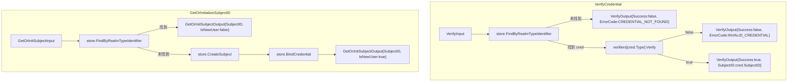

# password-verify Design

> 来源：`codestable/roadmap/identity-core/identity-core-roadmap.md` §4 接口契约（硬约束）
> 前置：f1 `domain-and-crypto` done — 类型、接口、Snowflake、bcrypt 均已就位

## 0. 术语表

沿用 f1 术语，新增：

| 术语 | 定义 | 类型 |
|------|------|------|
| VerifyInput | 凭证校验入参：Realm + IdentityType + Identifier + 用户输入的验证物 | struct（根包 `identity`） |
| VerifyOutput | 校验结果：Success + SubjectID + ErrorCode/ErrorMsg | struct（根包） |
| GetOrInitSubjectInput | 静默解析入参：Realm + IdentityType + Identifier | struct（根包） |
| GetOrInitSubjectOutput | 解析结果：SubjectID + IsNewUser | struct（根包） |
| MockStore | 内存 IdentityStore 实现，供测试和演示用 | struct（`internal/store`） |

## 1. 决策与约束

### 1.1 在项目结构中的位置

**现状**：根包有类型（model.go / errors.go / store.go），`internal/` 有 idgen 和 crypto，`usecase/` 空目录。

**本次放置**：
- 新增 `api.go` 到根包——API 输入/输出类型（调用方可见）
- 新增 `usecase/` 下的两个编排函数——VerifyCredential、GetOrInitializeSubjectID
- 新增 `internal/store/mock.go`——内存 Mock，测试用

**放置理由**：usecase 是纯函数（参数注入依赖），根包的 IdentityStore + Verifier 接口保证可测试性。f5 之后用 IdentityCore 结构体包裹。

### 1.2 明确不做

- 不提供 IdentityCore 结构体 / NewIdentityCore 构造函数——那是 f5 的职责
- 不实现 TOTP / WeChat 等非密码类型的校验——VerifyCredential 只管 PASSWORD，其余类型由 f3 扩展
- 不实现 BindCredential / ListCredentials 编排——那是 f4 的职责
- 不连接真实数据库——MockStore 是纯内存实现
- 不处理 subject 冻结状态（AccountLocked）——当前 IdentityStore 未暴露 subject status 查询，冻结判定留给 roadmap update 后的 feature

### 1.3 关键设计决策

**D1：usecase 函数形态——纯函数注入，非 struct 方法**
- VerifyCredential 函数签名：`(ctx, store, verifiers map[IdentityType]CredentialVerifier, input) → (output, error)`
- GetOrInitializeSubjectID 签名：`(ctx, store, input) → (output, error)`
- 理由：f2 阶段不引入 IdentityCore 结构体。usecase 作为独立可测的纯函数，f5 再包裹

**D2：CreateSubject 与 IDGenerator 的关系**
- CreateSubject 签名保持 `(ctx) (int64, error)` 不变（roadmap 契约）
- MockStore 内部持有 IDGenerator，`CreateSubject` 调用时由 store 生成 ID
- usecase 层不直接调用 IDGenerator——通过 store 间接使用
- 理由：store 是 ID 生成的唯一入口，避免 usecase 和 store 各自生成 ID 造成不一致

**D3：Verifier 注册——map 注入**
- usecase 接收 `map[IdentityType]crypto.CredentialVerifier`
- 本 feature 仅注册 `TypePassword → &crypto.Bcrypt{}`
- f3 扩展时追加 `TypeTOTP → &crypto.TOTP{}` 即可，不折腾 usecase 代码
- 理由：扩展点在最外层（调用方构造 map），use case 内部零改动

### 1.4 复杂度档位

与 f1 一致——对外发布库：L3 + modules + public + tested + validated。无新增偏离。

## 2. 编排-计算分离视图

### 2.1 名词层

**现状**（来自 f1）：
- `model.go:4` `SubjectID = int64`，`Realm = string`，`IdentityType string` + 6 常量
- `model.go:22` `Credential` struct，`model.go:31` `CredentialSummary` struct
- `errors.go:6-10` 5 个哨兵错误
- `store.go:6` `IdentityStore` 接口（4 方法）
- `internal/idgen/idgen.go:4` `IDGenerator` 接口
- `internal/crypto/verifier.go:6` `CredentialVerifier` 接口
- `internal/crypto/bcrypt.go:12` `Bcrypt` struct，`Hash()` / `Verify()` 函数

**变化**：

#### 新增 API 输入/输出类型（根包 `identity/api.go`）

```go
// VerifyInput 凭证校验入参
type VerifyInput struct {
    Realm        string       // 领域
    IdentityType IdentityType // 凭证类型
    Identifier   string       // 标识符（手机号 / 用户名）
    InputData    string       // 用户输入的验证物（明文密码）
}

// VerifyOutput 校验结果
type VerifyOutput struct {
    Success   bool   // 校验是否通过
    SubjectID int64  // 仅在 Success=true 时有效
    ErrorCode string // ACCOUNT_LOCKED / INVALID_CREDENTIAL / CREDENTIAL_NOT_FOUND
    ErrorMsg  string // 人类可读描述
}

// GetOrInitSubjectInput 静默解析入参
type GetOrInitSubjectInput struct {
    Realm        string       // 领域
    IdentityType IdentityType // 凭证类型
    Identifier   string       // 标识符
}

// GetOrInitSubjectOutput 解析结果
type GetOrInitSubjectOutput struct {
    SubjectID int64 // 已有或新创建的 subject_id
    IsNewUser bool  // 是否为新注册
}
```

#### 新增 MockStore（`internal/store/mock.go`）

```go
// MockStore 内存 IdentityStore 实现，用于测试
type MockStore struct {
    idGen    idgen.IDGenerator
    subjects map[int64]bool
    creds    map[string]*identity.Credential // key: "realm|type|identifier"
}

func NewMockStore(idGen idgen.IDGenerator) *MockStore
// 实现 IdentityStore 全部 4 方法：
//   FindByRealmTypeIdentifier → 查 map，未找到返回 ErrCredentialNotFound
//   CreateSubject → 调 idGen.Generate() 生成 ID，写入 subjects map
//   BindCredential → 检查 key 唯一性（ErrDuplicateCredential）+ subject 存在性（ErrSubjectNotFound），写入 creds map
//   ListBySubjectRealm → 遍历 creds 按 subjectID+realm 筛选，返回 CredentialSummary
```

### 2.2 编排层

**现状**：无。`usecase/` 为空目录。

**主流程图**：



**线性拓扑**——两个 usecase 各自是线性的 3-4 步序列，无分支并行。

### 2.3 挂载点

按"删了它 feature 是否消失"判据：

| # | 挂载点 | 消费方 | 说明 |
|---|--------|--------|------|
| 1 | 根包 `api.go` — VerifyInput/Output + GetOrInit 类型 | f3-f5 + 调用方 | API 契约的类型定义 |
| 2 | `usecase/verify_credential.go` — VerifyCredential 函数 | f3（扩展 Verifier 注册） + f5（包裹进 IdentityCore） | 密码校验编排 |
| 3 | `usecase/get_or_init_subject.go` — GetOrInitializeSubjectID 函数 | f5（包裹进 IdentityCore） | 静默注册编排 |
| 4 | `internal/store/mock.go` — MockStore | f3-f4 的测试 + 调用方演示 | 内存 IdentityStore 实现 |

### 2.4 推进策略

按 paradigm 维度切片：

1. **API 类型定义**：`api.go` 新增 4 个 struct。编译通过即验证
2. **MockStore 实现**：`internal/store/mock.go`。验证：模拟 CRUD 操作均正确
3. **VerifyCredential 编排**：`usecase/verify_credential.go`。验证：正确密码通过、错误密码拒绝、凭证未找到报错
4. **GetOrInitializeSubjectID 编排**：`usecase/get_or_init_subject.go`。验证：已有凭证返回已有 ID、新凭证创建 subject
5. **测试覆盖**：单元测试（MockStore CRUD + 两个 usecase 各 3 条场景） + 端到端测试（创建→验证完整闭环）

## 3. 验收契约

### 正常路径

| # | 输入 / 触发 | 期望可观察结果 |
|---|-------------|---------------|
| C1 | `VerifyCredential(store, {PASSWORD}, verifiers, correct_input)` | `Success=true`, SubjectID 非零 |
| C2 | `GetOrInitializeSubjectID(store, {PASSWORD}, new_identifier)` | `IsNewUser=true`, SubjectID 非零，该 credential 被持久化 |
| C3 | 同一 identifier 再次 `GetOrInitializeSubjectID` | `IsNewUser=false`, 返回相同 SubjectID |
| C4 | C2 创建后用 C1 校验正确密码 | `Success=true`, SubjectID 匹配 |

### 边界与错误

| # | 输入 / 触发 | 期望可观察结果 |
|---|-------------|---------------|
| C5 | `VerifyCredential` 凭证未找到 | `Success=false`, ErrorCode=`CREDENTIAL_NOT_FOUND` |
| C6 | `VerifyCredential` 密码错误 | `Success=false`, ErrorCode=`INVALID_CREDENTIAL` |
| C7 | `BindCredential` 同 Realm+Type+Identifier 重复 | 返回 `ErrDuplicateCredential` |
| C8 | `BindCredential` 的 SubjectID 不存在 | 返回 `ErrSubjectNotFound` |

### 明确不做反向核对

| 不做项 | 反向核对 |
|--------|---------|
| 无 IdentityCore struct | grep `type IdentityCore struct` zero match |
| 无 BindCredential / ListCredentials 编排 | grep `func BindCredential\|func ListCredentials` zero match（只允许 store 接口声明和 mock 实现方法） |
| 无 TOTP 实现代码 | grep `TOTP` 仅 `model.go` TypeTOTP 常量 |
| 无真实 DB 连接 | grep 无 MySQL/Redis 连接代码 |

## 4. 对架构的反射

### 新增模块

本 feature 新增：
- `usecase/` 包：两个编排函数（之前为空目录）
- `internal/store/` 包：MockStore 实现
- 根包 `api.go`：4 个 API 入/出参类型

### 架构 doc 更新提示

`ARCHITECTURE.md` 需新增：
- `usecase/` 模块条目（verify_credential.go + get_or_init_subject.go）
- `internal/store/` 模块条目（mock.go）
